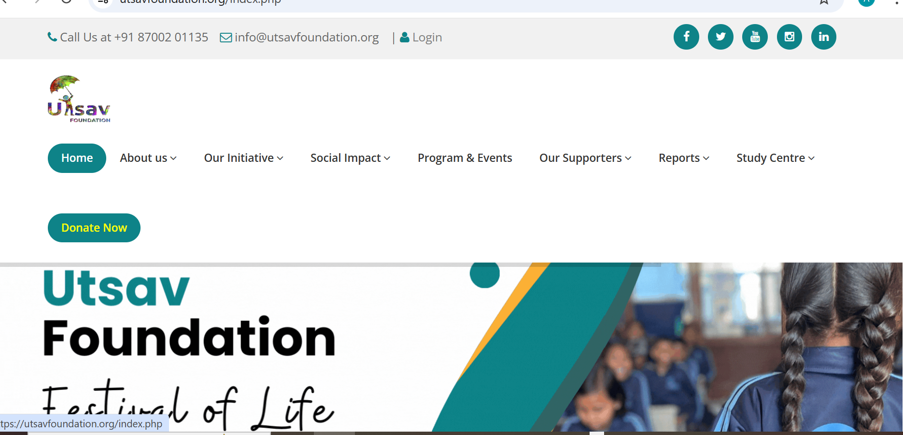
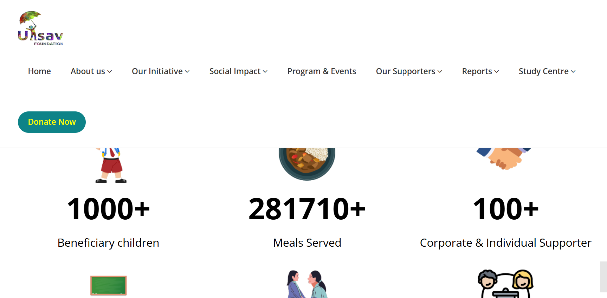
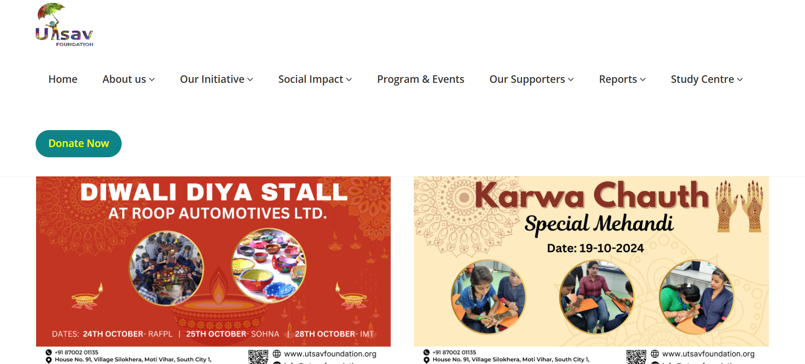
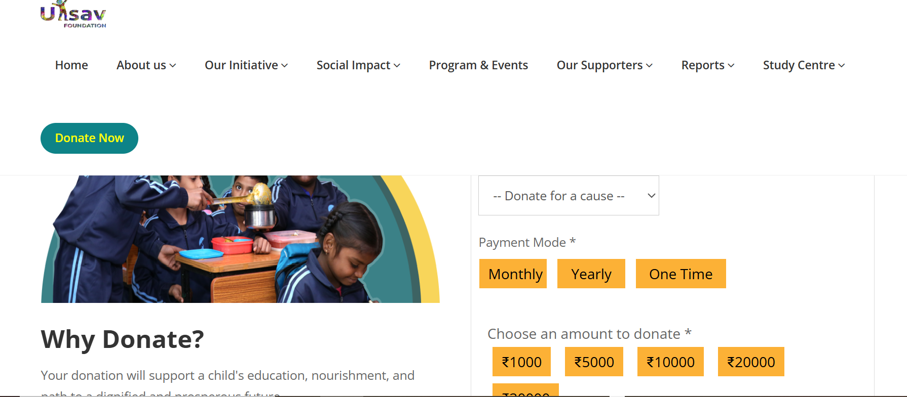
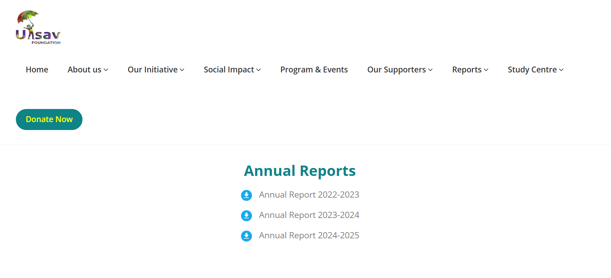
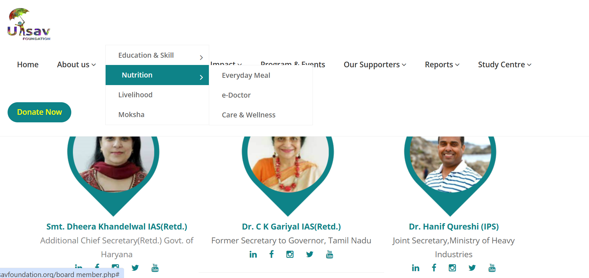
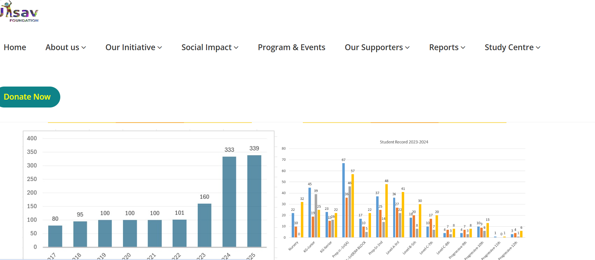

# 🌐 Utsav Foundation Website — Case Study  

A dynamic NGO campaign and donation management website built during my internship.  
This platform allows NGOs to run donation drives, onboard volunteers, publish reports, and manage campaigns online.  

> *Note:* Source code is proprietary. This repository serves as a *case study* showcasing the architecture, features, screenshots, and my contributions.  

---

## 🚀 Project Overview  
- *Goal:* Build a secure, scalable website to manage NGO campaigns and online donations.  
- *Role:* Full-stack developer (auth, payment integration, admin workflows, backend optimization).  
- *Outcome:* Successfully deployed on *Hostinger*, currently used by the NGO for real campaigns.  

---

## 🛠 Tech Stack  
- *Frontend:* HTML5, CSS3, JavaScript  
- *Backend:* PHP (session-based auth)  
- *Database:* MySQL  
- *Security:* HTTPS, input sanitization, password hashing (bcrypt), CAPTCHA  
- *Hosting:* Hostinger  

---

## ✨ Features  
- Secure login & session-based authentication  
- Admin dashboard for campaigns, events & reports  
- Donation system with *payment gateway integration*  
- Campaign CRUD (create, read, update, delete)  
- Annual reports & event updates for transparency  
- Optimized backend queries for performance  

---

## 🖼️ Screenshots  

### Home Page  
  
## Mission Page

### Events & Campaigns  
  
### Donation Flow  
  
### Annual Reports Section  
  
## Advisory list Page
 
### Curriculum Page 
 
## Metrices Page

---

## 📄 My Contributions  
- Developed secure login/session workflows  
- Built campaign & event management modules (CRUD)  
- Integrated *payment gateway* for donations  
- Designed admin workflows & dashboards  
- Applied input sanitization, HTTPS, CAPTCHA  
- Deployed app on Hostinger  

---

## 📢 Notes  
This repository is for *documentation purposes only*.  
Source code is not public due to confidentiality, but this case study highlights my role in building a *live, production-ready NGO platform*.
